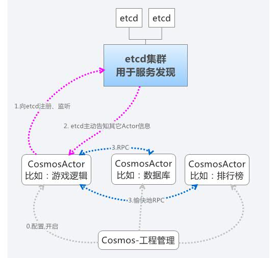

# cosmos

实验中....
[experimental now]
a node js distributed game server framework

实验性的游戏服务器框架，

## 架构

### 以etcd为中心(master)

我是一个actor，向etcd注册我自己，然后etcd就告诉我的同伴——其它actor了

然后，我就可以跟他们rpc了！我就是我！

有一天，一个新的actor又加入了，

etcd会主动告诉我，然后我又可以跟这个新成员rpc了

看起来etcd很重要嘛！它（master）死了怎么办？

不要紧, etcd是分布式高可用的！etcd1死了，etcd2补上

### 类比, 学生与学校

## cosmos模块化

* cosmos : 本质上一个工程管理器，读取配置，启动actor
	* cosmos-actor : 核心，一个自动发现的RPC框架，可脱离cosmos单独使用，向etcd注册，向同伴rpc
	* cosmos-logger : 打印日志，无他

## 希望使用....

* 尽可能的少写代码：不要忙死在折腾的事情上
* 尽可能的使用稳定的第三方库：不重复造轮子
* 尽可能的精简架构：越精简的架构越不易出问题

## 去实现....

* 超级简单的使用
* 分布式：多台机器可不是
* master高可用
* 任意逻辑服务器被kill自动重启
* 无状态：进程被kill的影响降到最低
* 可协程, 可Promise

## Node Js开发组件

* babel(考虑去掉): 使用最新的ECMAScript 6进行开发，纯面向对象，要配合Gulp
* bluebird/promise: NodeJS回调优化

## 关键的第三方组件/库:

* etcd: 中央配置储存，分布式，实现整体服务高可用
* zeromq: 套接字库，增强网络连接的稳健性
* zerorpc: 基于zeromq的RPC服务, 实现所有节点的稳健调用
* redis: 服务数据缓存，实现app无状态的关键，每一个物理机有独立的redis缓存
* redlock: redis分布式锁，实现稳健的缓存读写
* pm2: 进程管理器，实现进程自动重启
* msgpack: 通讯协议，优化过的json
* ansible: 分布式部署

## 节点

### rpc

### 客户端

* http
* zeromq/netmq

## 灵感来源

pomelo...